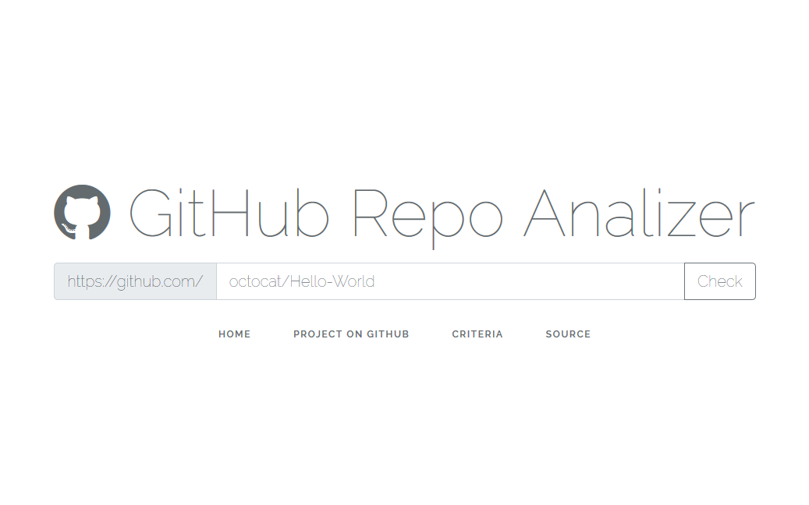

# GitHub Repository Analyzer

This tool is aiming to serve as a simple indicator for helping people while deciding which open-source projects to collaborate with translation, creating tutorials, guides etc. rather than coding, bug fixing, adding new features or creating documentations. Of course helping and contributing to an open-source project in any regard would definitely help project owner and other people benefiting from it.

> Please give a hand to an open-source project, if you can! For sure, any open-source project moves our humanity and technology forward.

We are aware of people have different reasons while contributing to open-source  projects and selection could be very subjective. We intended to come up with a tool which have slightly more objective criteria and help indecisive people to measure projects. Therefore the calculation could variate regarding factors and their importance in calculation formula. We basically suggest an approach here.

The tool creates a simple output of factors like project's commits, branches, contributors, stars, forks and last update time.

We are just adding an another dimension while choosing which project to contribute. The tool could be transformed into more complex version with changing calculation formula and taking more factors into consideration.

The tool does not suggest anything about project's overall quality
or does not give any clue about projects code's integrity. For this reason [Travis-CI](https://travis-ci.org/) or [Scrutinizer-CI](https://scrutinizer-ci.com/) could be used as a complimentary tool. These values could be used in the calculation in the future versions as well under code quality factor.

You can run this tool directly [here](http://github.ikidnapmyself.com) or you can install it for yourself and customize the calculation.

Any contribution is highly appreciated.

Enjoy the tool!

### Technical Background

It collects the data from [GitHub APIv3](https://developer.github.com/v3/) and summarize it in a row. It's easy to install, customize and use. It's so simple, because simple is the best!

### Install

It requires no DB connection! It just works with cached GitHub APIv3 response!

```
$ git clone https://github.com/frnxstd/repo-analyzer
$ composer install
$ php artisan serve
```

>Please do not forget to configure .env for your expectations. `.env.example` file may help you. Otherwise it will use
>defaults.


### How to use?

Write or copy and paste :owner/:repo path of the URL. Let's check this repository.



Bob is your uncle!